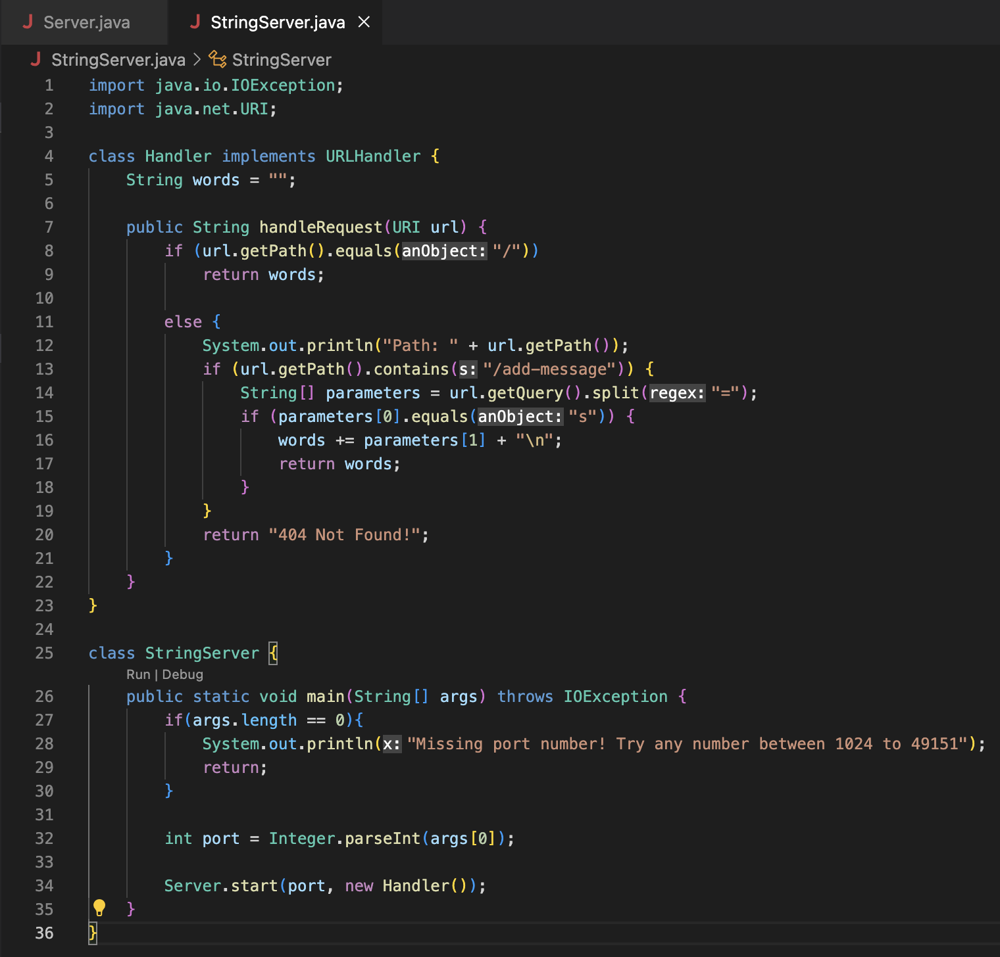
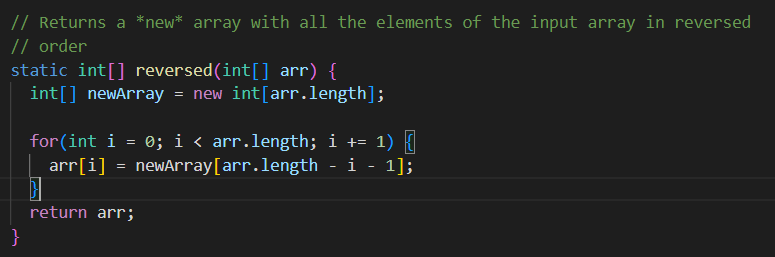
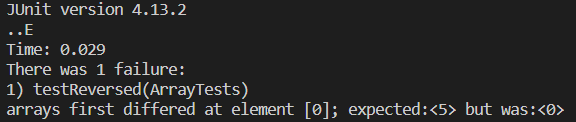

# Installing VSCode
1. Open the VSCode website and click the blue install button to download VSCode. 


2. Open VSCode and go to the home page.

# Connecting to a Remote Server

1.  Use [this link](https://stackoverflow.com/questions/42606837/how-do-i-use-bash-on-windows-from-the-visual-studio-code-integrated-terminal/50527994#50527994) to use Git with VSCode

2. To use ssh to connect to a remote server, open a new terminal window and type in the command 
`$ ssh cs15lwi23zz@ieng6.ucsd.edu` 
Replace the "zz" with your account's last three letters. 

3. You will receive the following message as this is your first time connecting to a remote server: 



Select "yes" by typing in yes. 

4. There should be a request for your password: 


Type in your password. After this, your terminal is connected to a remote server. 

# Trying some commands. 

Here are some of the commands to try: 

```
cd ~
cd
ls -lat
ls -a
cp /home/linux/ieng6/cs15lwi23/public/hello.txt ~/
cat /home/linux/ieng6/cs15lwi23/public/hello.txt
```

Some of the commands and their outputs are shown below. Your outputs should be similar.
	
	


