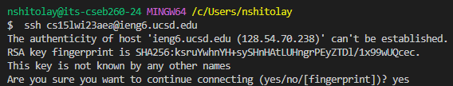
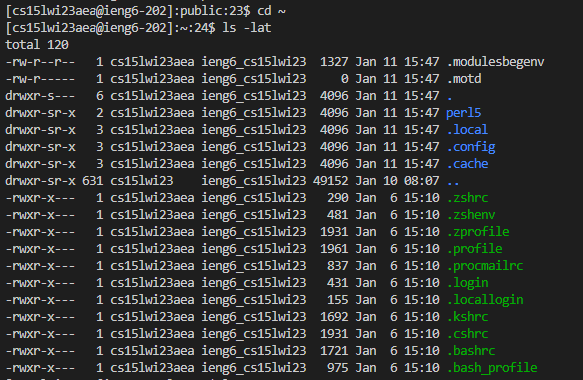

# Installing VSCode
- Open the VSCode website and click the blue install button to download VSCode. 


- Open VSCode and go to the home page.

# Connecting to a Remote Server

- Use [this link](https://stackoverflow.com/questions/42606837/how-do-i-use-bash-on-windows-from-the-visual-studio-code-integrated-terminal/50527994#50527994) to use Git with VSCode

- To use ssh to connect to a remote server, open a new terminal window and type in the command 
`$ ssh cs15lwi23zz@ieng6.ucsd.edu` 
Replace the "zz" with your account's last three letters. 

- You will receive the following message as this is your first time connecting to a remote server: 



Select "yes" by typing in yes. 

- There should be a request for your password: 


- Type in your password. After this, your terminal is connected to a remote server. 

# Trying some commands. 

- Here are some of the commands to try and their descriptions of what they do: 

```
cd ~
Allows you to change directories

ls -lat
Displays a list of files and directories in the specified folder

cp /home/linux/ieng6/cs15lwi23/public/hello.txt ~/
Copies your files to the new specified directory

cat /home/linux/ieng6/cs15lwi23/public/hello.txt
Reads data from the specified file and concatenates and displays its data
```


- Some of the commands and their outputs are shown below. Your outputs should be similar.
	
	
