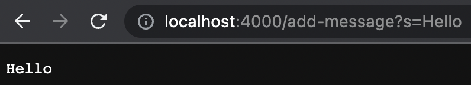
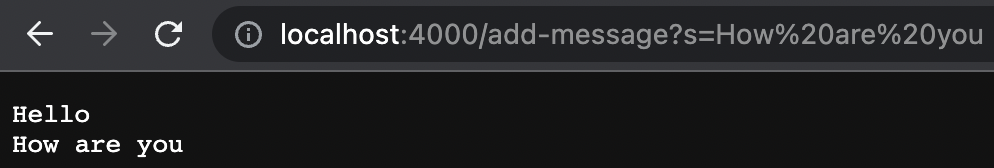
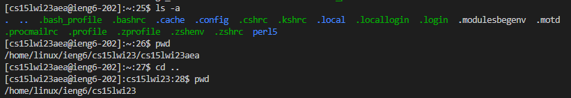

# Part 1 - Writing a Web Server 

1. StringServer Code

```
import java.io.IOException;
import java.net.URI;

class Handler implements URLHandler {
    String words = "";

    public String handleRequest(URI url) {
        if (url.getPath().equals("/")) 
            return words;
        else {
            System.out.println("Path: " + url.getPath());
            if (url.getPath().contains("/add-message")) {
                String[] parameters = url.getQuery().split("=");
                if (parameters[0].equals("s")) {
                    words += parameters[1] + "\n";
                    return words;
                }
            }
            return "404 Not Found!";
        }
    }
}

class StringServer {
    public static void main(String[] args) throws IOException {
        if(args.length == 0){
            System.out.println("Missing port number! Try any number between 1024 to 49151");
            return;
        }

        int port = Integer.parseInt(args[0]);

        Server.start(port, new Handler());
    }
}
```

2. Examples of using StringServer

- The methods that are called are the `main` method in the StringServer class and the `handleRequest` method in the URLHandler class.
- The argument for the `main` method is 4000. The argument for the `handleRequest` method is the url of the server. The field variable `String word` is an empty string initially.
- The field variable `String word` changes every time a new word is added as it adds the new word to the end of the String. `String word` changed to "Hello" after the request. The URI changes to http://localhost:4000/add-message?s=Hello

- The methods that is called is the `handleRequest` method in the URLHandler class.
- The argument for the `handleRequest` method is the url of the server. The field variable `String word` is "Hello" initially.
- The field variable `String word` changes every time a new word is added as it adds the new word to the end of the String. `String word` changed to "Hello" + "\n" + "How are you" after the request. The URI changes to http://localhost:4000/add-message?s=How%20are%20you

# Part 2 - Debugging

1. Code with bug
```
 // Returns a *new* array with all the elements of the input array in reversed
  // order
  static int[] reversed(int[] arr) {
    int[] newArray = new int[arr.length];
    for(int i = 0; i < arr.length; i += 1) {
      arr[i] = newArray[arr.length - i - 1];
    }
    return arr;
  }
```  
2. Input that does not induce a failure 
```
@Test
public void testReversed() {
    int[] input1 = { };
    assertArrayEquals(new int[]{ }, ArrayExamples.reversed(input1));
}
```
3. Failure inducing input
```
@Test
public void testReversed() {
    int[] input2 = {1, 2, 3, 4, 5};
    assertArrayEquals(new int[]{5, 4, 3, 2, 1}, ArrayExamples.reversed(input2));
}
```
4. Symptom as the output of running tests



5. Code without bug
```
 // Returns a *new* array with all the elements of the input array in reversed
  // order
  static int[] reversed(int[] arr) {
    int[] newArray = new int[arr.length];
    for(int i = 0; i < arr.length; i += 1) {
      newArray[i] = arr[arr.length - i - 1];
    }
    return newArray;
  }
``` 

The fix addresses this issue because initially, the elements of `newArray` were being reversed which were all initially 0 resulting in `arr` becoming a 0 array. Switching `newArray` with `arr` let the elements of `arr` to be properly reversed into `newArray` which was returned. 

# Part 3 - What I learned 
The labs in the past two weeks were very interesting. From lab 2, I learned how to write a simple web server and show output on it. From lab 3, I also learned how to debug programs in a more efficient manner. The JUnit tests helped me find bugs more easily and sped up the debugging process overall. 
